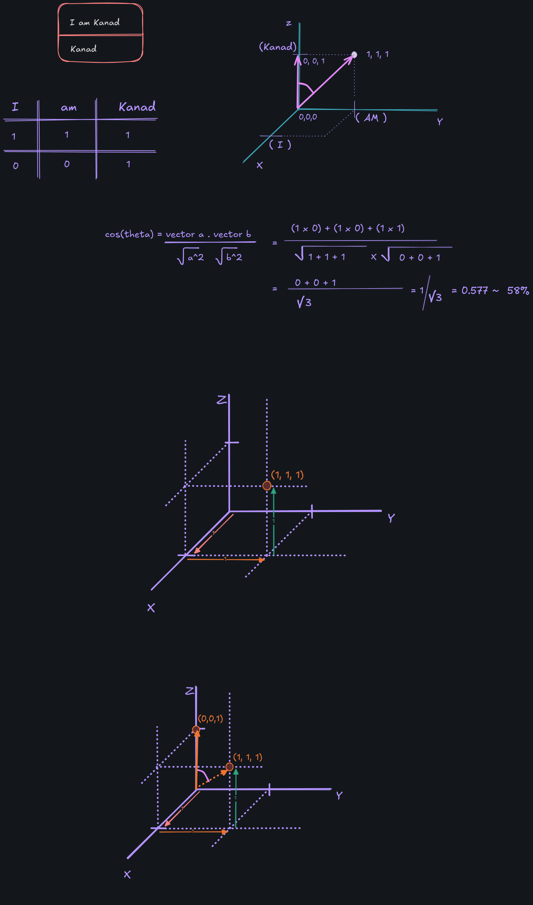

# 🔍 Vector Similarity Search Demo
---

## A simple visualization:

> A minimal project to understand how **cosine similarity** works in a **vector database** 🧠📊.  
> It demonstrates **semantic search** by converting text into embeddings and comparing them using vector math.

---

## 🧰 Tech Stack

- ⚙️ Node.js + TypeScript  
- 🧾 Custom in-memory vector store  
- 📐 Cosine similarity algorithm

---

## 💡 What You’ll Learn

- 🔤 How text embeddings are used in vector search  
- 📏 How cosine similarity compares semantic meaning  
- 🎯 Filtering using `topK` and `threshold` parameters  
- ⚡ Real-world basics of how vector DBs like Pinecone, Weaviate, or FAISS work

## License
[MIT License](LICENSE)